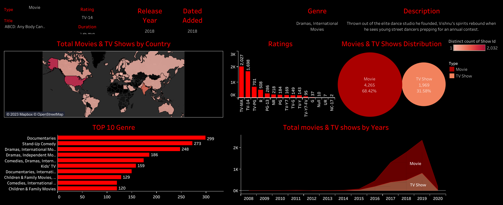

# Netflix Data Exploration

https://www.kaggle.com/code/vivekfifa/netflix-shows-data-analysis

https://public.tableau.com/app/profile/vivek.kumar5704/viz/Netflix_16989935262120/Netflix
# Netflix Data Exploration with Python and Tableau

## Overview

This project involves exploring Netflix data using Python for data analysis and Tableau for visualization. The goal is to gain insights into the content available on Netflix and present the findings through an interactive Tableau dashboard.

## Tools Used

- **Python**: Utilized for data cleaning, preprocessing, and analysis.
- **Tableau**: Employed for creating interactive and insightful visualizations.

## Project Steps

1. **Data Collection**: The dataset was sourced from Kaggle, providing comprehensive information about Netflix content.

2. **Data Cleaning and Preprocessing**: Python was used to clean and preprocess the data, handling missing values and ensuring data quality.

3. **Exploratory Data Analysis (EDA)**: Python was employed for statistical analysis and visualization to uncover patterns and trends in the Netflix dataset.

4. **Tableau Dashboard Creation**: A dynamic and interactive Tableau dashboard was crafted to present key insights in a user-friendly manner.

## Kaggle Notebook

For detailed code and analysis, refer to the Kaggle notebook associated with this project: [Netflix Data Exploration - Kaggle Notebook](https://www.kaggle.com/code/vivekfifa/netflix-shows-data-analysis)

## Tableau Dashboard

Explore the interactive Tableau dashboard [here](https://public.tableau.com/app/profile/vivek.kumar5704/viz/Netflix_16989935262120/Netflix).

Feel free to reach out for any questions or further details!
